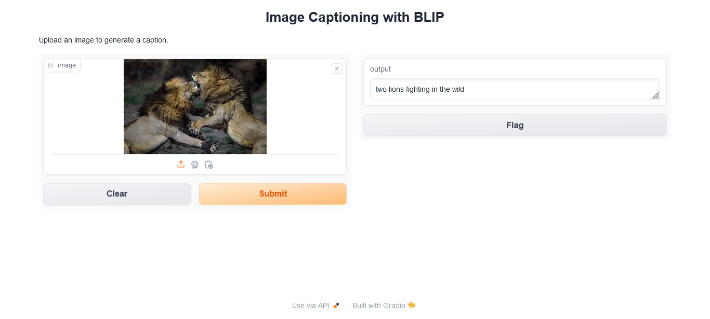

# image2Text-using-gradio
This is a simple python image classification model that convert the input image to text. #python, #pytorch,#BLIP model, #gradio

# Step 
- clone the repo
- create environment variable: 'python -m venv myenv'
- activate environment variable: './myenv/Scripts/activate'
- install torch & gradio: 'pip install gradio torch torchvision torchaudio
- run python: 'python main.py'

# Screenshot of the Output

 

